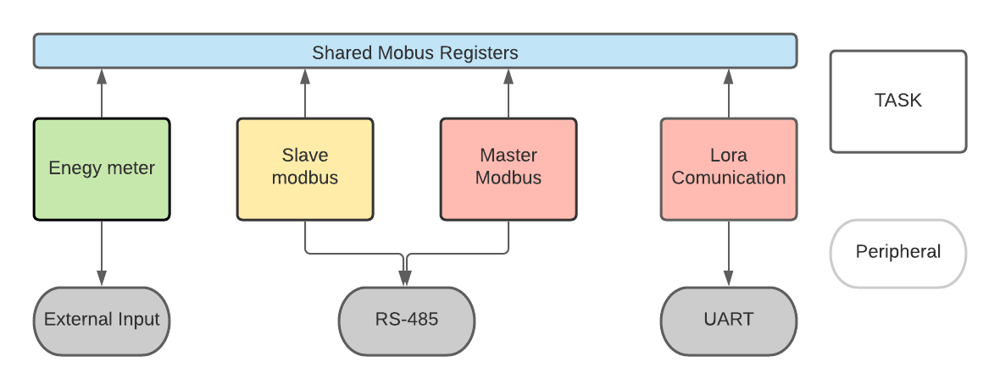

# Description

This software is the code for an ESP-32 MCU that will work as an edge node in a network used to monitor energy consumption.

This node has also the capability of Modbus comunication as a Slave and Master RTU serial.

In additon, comunication with a LoRa device is also available.

# System description

## Diagram

## Tasks

Each task can be enabled separately, so his node can be used as master or slave, can have connected the LoRa or not, and can other modules can be added

The task does not communicate directly to echa other, they only share the same resource, which is memory.

## Modbus shared memory

- Holding registers hold the node specific settings
- Input register holds the energy measure.

## Settings

- Settings can done through Modbus

# Installation
1.Clone the repository:

`git clone https://gitlab.com/electr-nica/desarrollohardware/edge-node.git`

2.Open the project in the terminal and build the menuconfig:

`make menuconfig`

3.Navigate to __custom configuration__ and select with the key __y__ what modules do you what to enable as well as the baudarate and serial port if apply. Then save and close.

4. Build the project:

`make all`

5. Flash the MCU:

`make flash`

6. Enjoy!

# Collaboration

If you use eclipse as IDE, after you properly installed esp-idf and the tool chanin of xtensa you just need a few steps to fully set up your project.

1. Open your project in a workspace.

2. Go to properties in your project folder, then go to environment in the C/C++ Built. Change the paths to match with your paths. 

3. Clean and Build. Make sure you made `make menuconfig` in your project through the terminal.

4. Enjoy!

 
