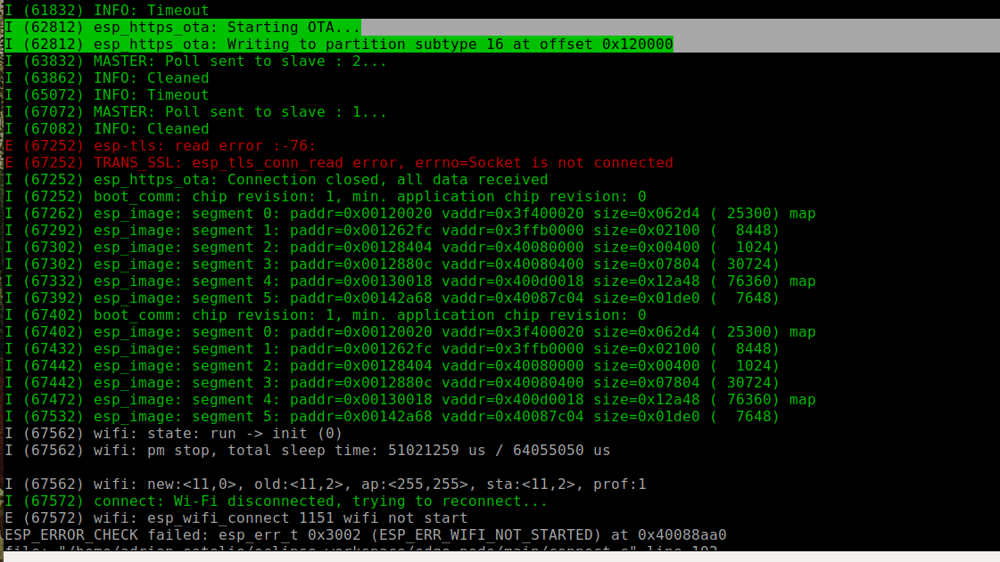

# Description 

This file describes the usage of the OTA update  module and capabilities of this application.

The OTA method used is through https using Wi-Fi

The firmware will be updated every 60 seconds. (Under test)

# Usage

Clean the flash first 

`make erase_flash`
## Run HTTPS Server
We need to create a self-signed certificate and run a simple HTTPS server as follows:


* Enter a directory where holds the root of the HTTPS server, e.g. `cd build`.
* To create a new self-signed certificate and key, you can simply run command `openssl req -x509 -newkey rsa:2048 -keyout ca_key.pem -out ca_cert.pem -days 365 -nodes`.
  * When prompted for the `Common Name (CN)`, enter the name of the server that the ESP32 will connect to. Regarding this  it is probably the IP address. The HTTPS client will make sure that the `CN` matches the address given in the HTTPS URL.
* To start the HTTPS server, you can simply run command `openssl s_server -WWW -key ca_key.pem -cert ca_cert.pem -port 8070`.
* In the same directory, there should be the firmware (e.g. hello-world.bin) that ESP32 will download later. It can be any other ESP-IDF application as well, as long as you also update the `Firmware Upgrade URL` in the menuconfig. The only difference is that when flashed via serial the binary is flashed to the "factory" app partition, and an OTA update flashes to an OTA app partition.
* **Notes:** If you have any firewall software running that will block incoming access to port *8070*, configure it to allow access while running the example.

## Flash Certificate to ESP32

Before you flash , make sure to copy the generated (inside build fonder) certificate to `server_certs` directory inside OTA  directory so that it can be flashed into ESP32 together with the firmware, e.g. `cp ca_cert.pem ../server_certs/`.

## Config the esp32
* In the `menuconfig` mark the `OTA config` under `custom configuration submenu`
* Then set up Wi-Fi SSID and password
* Also set the corresponding server address `https://<host-ip-address>:<host-port>/<firmware-image-filename>`
e.g. `https://192.168.2.106:8070/hello-world.bin`
* The firmware image (.bin file) should be locate in the build folder 

## Output from HTTPS server

```bash
FILE:hello-world.bin
ACCEPT
```

# The container way

After create the certificates, you can create a container using the Dockerfile located in the *server_certs* files, then:

- To create the container you can use `sudo docker build -t ota-server . `

- Then run it `docker run -p 8070:8070 --name ota-server -it ota-server`, if everything goes OK you shoud see a message like:

	```Using default temp DH parameters
	   ACCEPT
	```
- Finally you can go into the container terminal usign `sudo docker exec -it ota-server bash` and execute `source update.sh` to
update the .bin files, by download them for a github repo for example.


## Output from the ESP32


